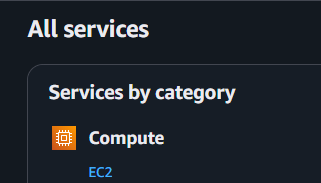
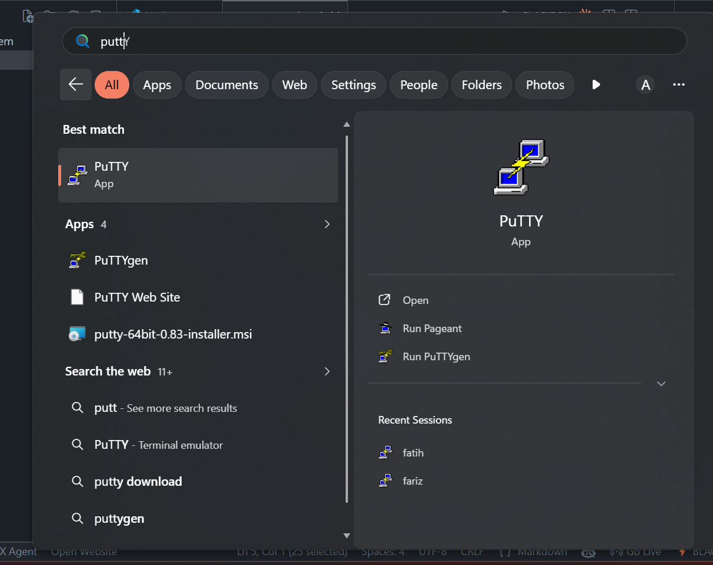
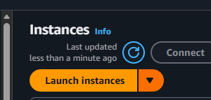
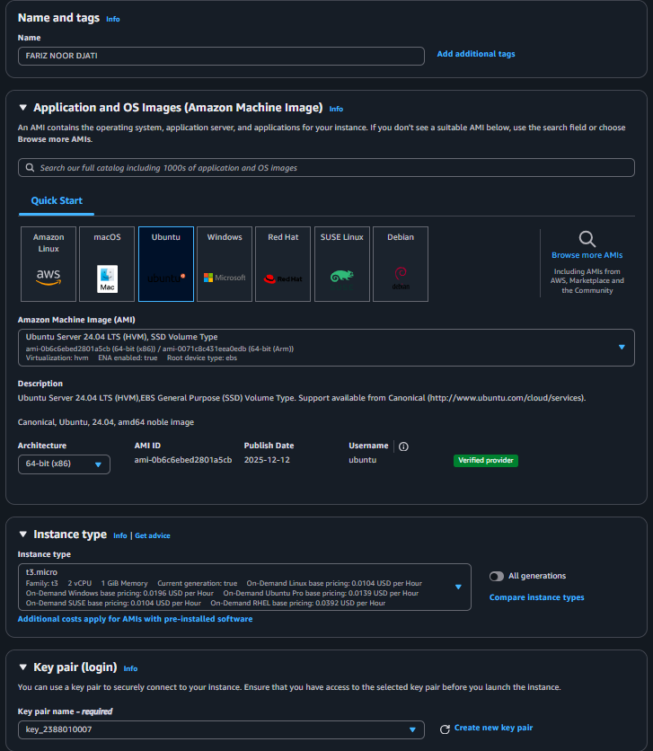
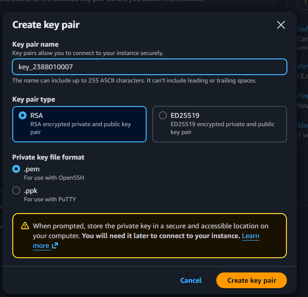
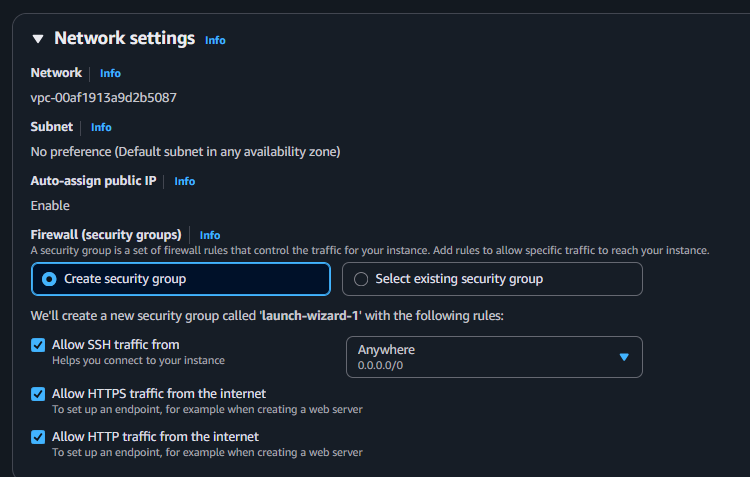
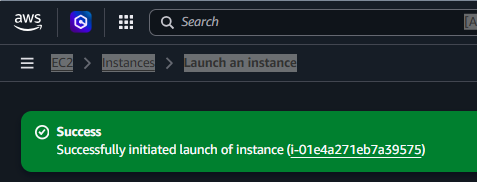

#step by step how to created ec2

1.click ec2

2.click instances

3.click launch instances

4.created your name

5.created your named & configure

6.create your keypair

7.network settings

8.click launch instances

9.succes
