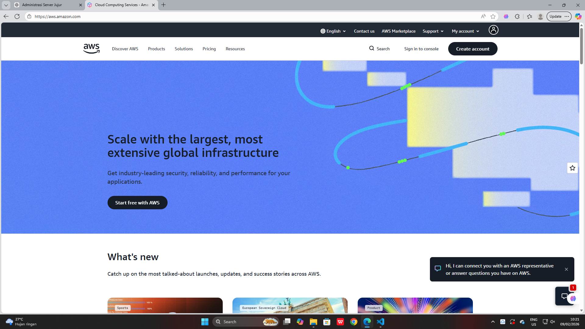
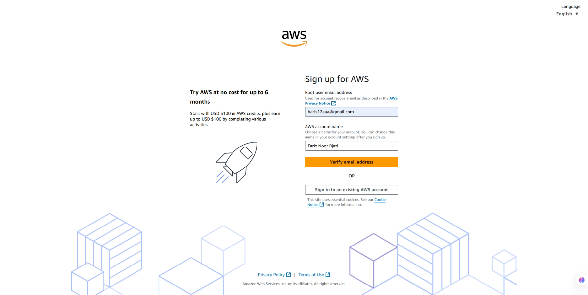
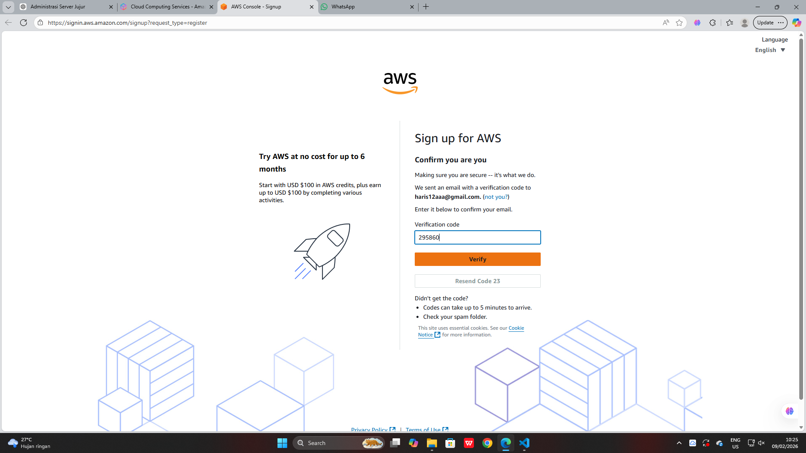
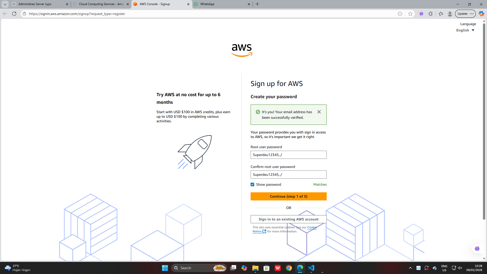
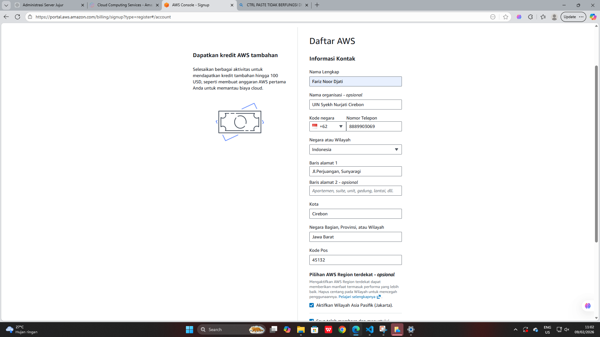
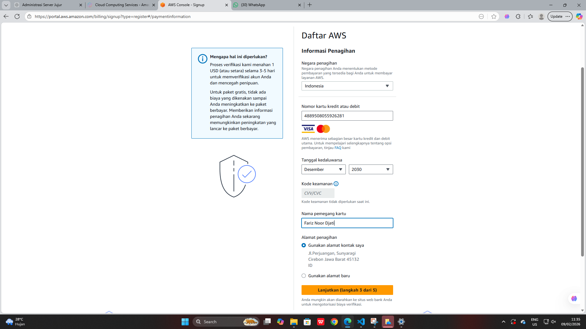
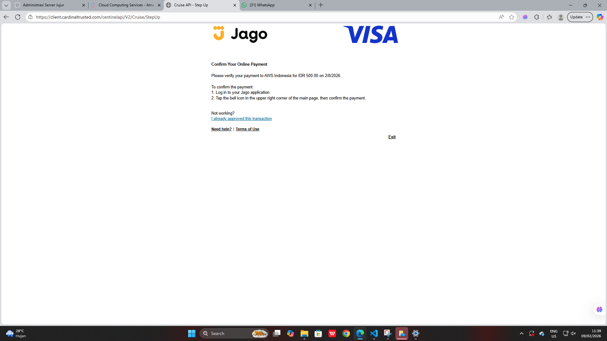
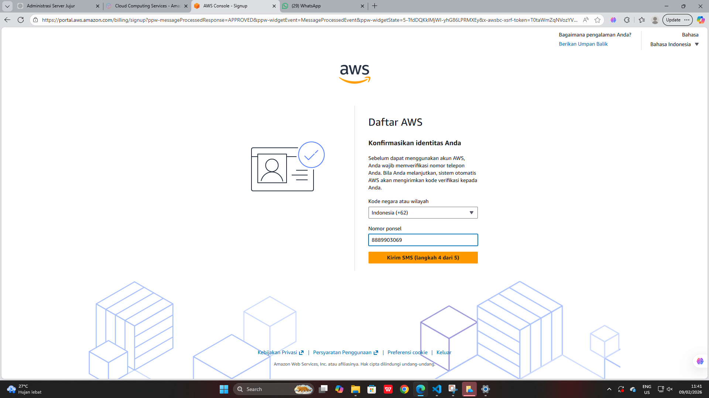
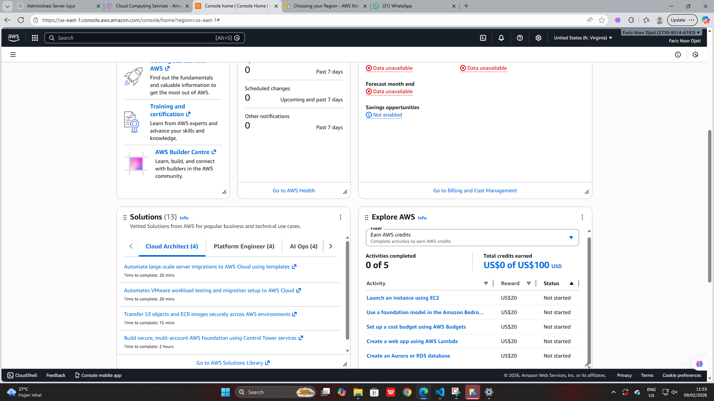

//how to created our account aws amazon by Fariz Noor Djati

1.go to website AWS https://aws.amazon.com/

2.created account

3.verify password your account

4.created your password account

5.created aws for free

6.add credit card account

7.confirm our payment

8.verify our no.telephone

9.succes
