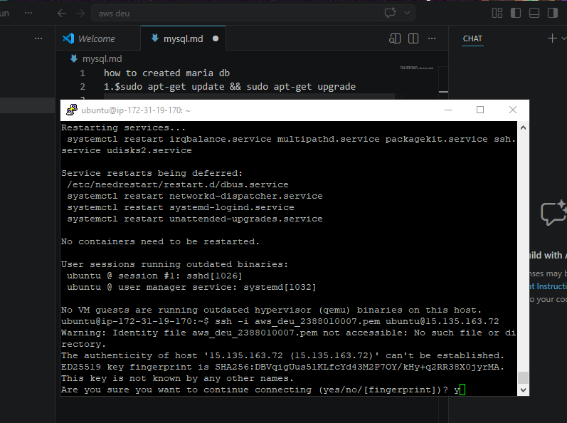
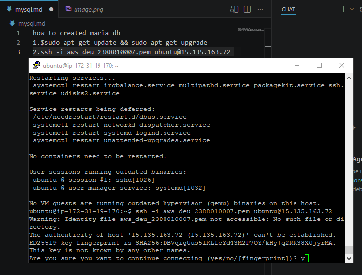
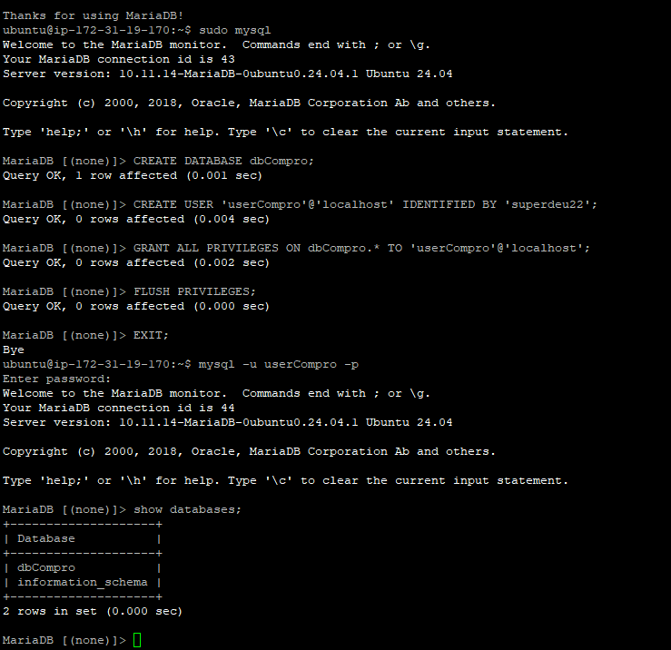
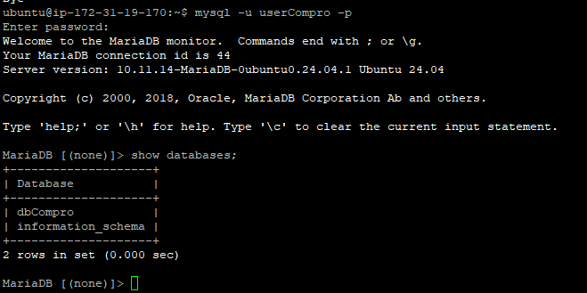

## 1. Proses SSH ke Server EC2

---

## 2. Patching / Update Sistem Operasi

---

## 3. Instalasi MariaDB Server

---

## 4. Proses Hardening dengan mysql_secure_installation

---

## 5. Pembuatan Database dan User

---

## 6. Pengujian Login User Baru

---

## 7. Finish

