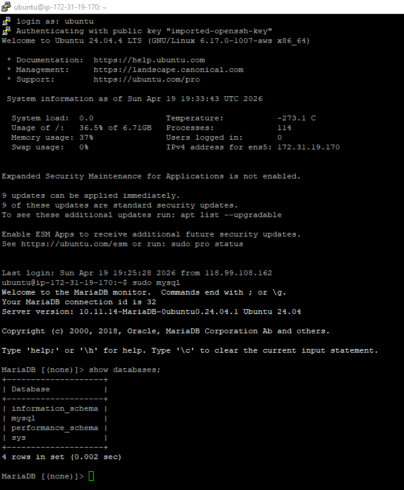
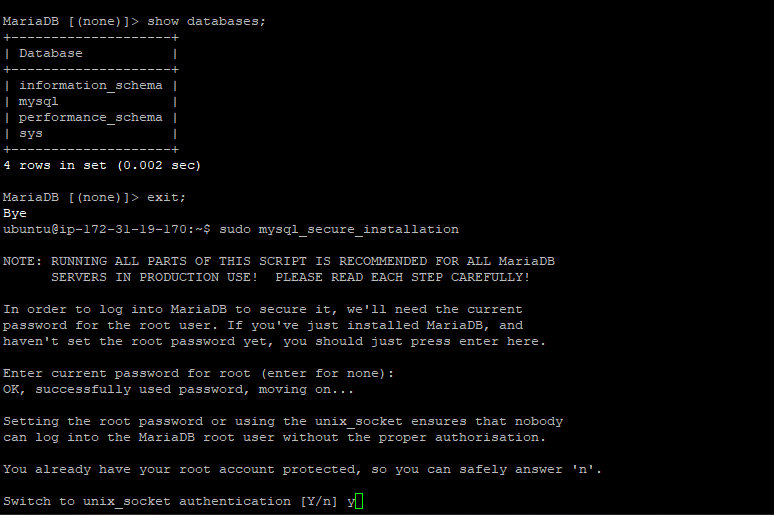
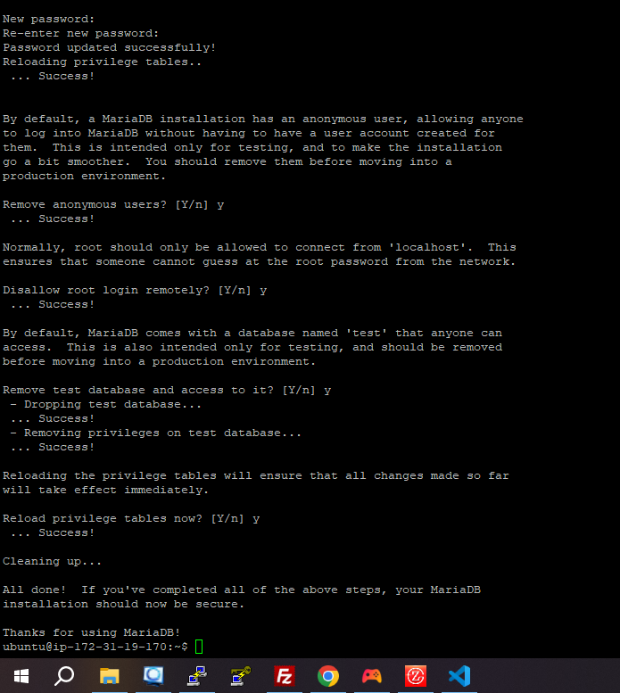

How to created our maria db
1.Proses SSH ke Server EC2

2.Patching / Update Sistem Operasi

3.Instalasi MariaDB Server

4.Proses Hardening dengan mysql_secure_installation

5.Pembuatan Database dan User

6.Pengujian Login User Baru (Finish)

